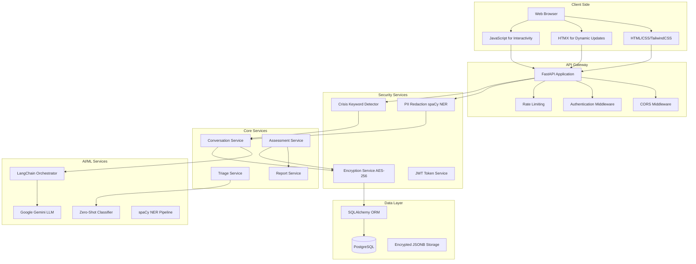
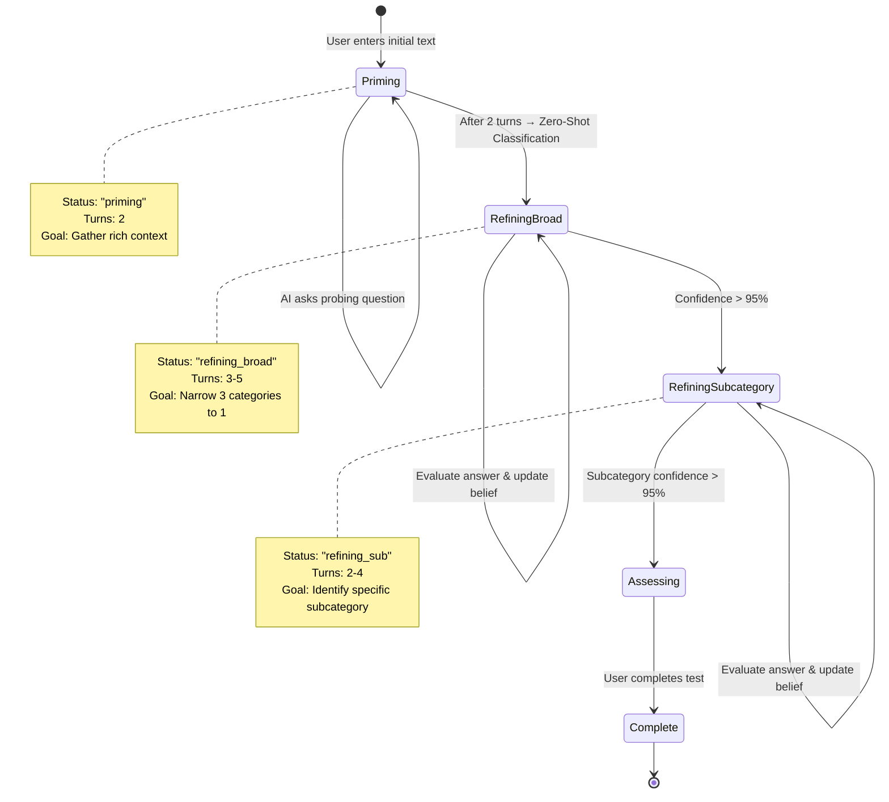
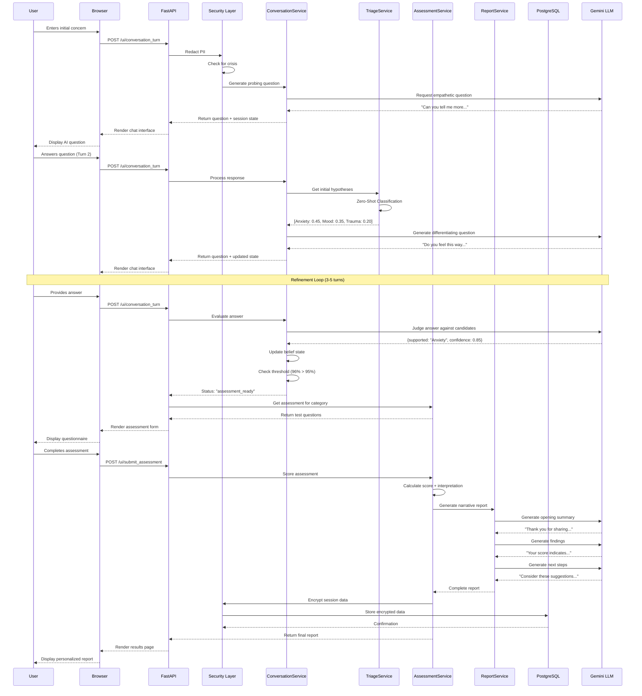

# Miraat System Architecture

**Comprehensive Technical Design Documentation**

---

## Table of Contents

1. [System Overview](#system-overview)
2. [Architecture Diagrams](#architecture-diagrams)
3. [Component Details](#component-details)
4. [Data Flow](#data-flow)
5. [Security Architecture](#security-architecture)
6. [AI/ML Pipeline](#aiml-pipeline)
7. [Database Schema](#database-schema)
8. [API Design](#api-design)
9. [Deployment Architecture](#deployment-architecture)

---

## System Overview

Miraat is built on a **layered architecture** with clear separation of concerns:

```
┌─────────────────────────────────────────────────────────────┐
│                    Presentation Layer                        │
│  (Jinja2 Templates + TailwindCSS + HTMX + JavaScript)       │
└─────────────────────────────────────────────────────────────┘
                            ↕
┌─────────────────────────────────────────────────────────────┐
│                      API Layer                               │
│         (FastAPI Endpoints + Request/Response Models)        │
└─────────────────────────────────────────────────────────────┘
                            ↕
┌─────────────────────────────────────────────────────────────┐
│                  Security Layer                              │
│       (PII Redaction + Crisis Detection + Auth)              │
└─────────────────────────────────────────────────────────────┘
                            ↕
┌─────────────────────────────────────────────────────────────┐
│                  Business Logic Layer                        │
│     (Conversation Orchestration + Assessment Logic)          │
└─────────────────────────────────────────────────────────────┘
                            ↕
┌─────────────────────────────────────────────────────────────┐
│                    Service Layer                             │
│  (Conversation + Triage + Assessment + Report + Security)    │
└─────────────────────────────────────────────────────────────┘
                            ↕
┌─────────────────────────────────────────────────────────────┐
│                  AI/ML Integration Layer                     │
│    (LangChain + Gemini LLM + Transformers + spaCy)          │
└─────────────────────────────────────────────────────────────┘
                            ↕
┌─────────────────────────────────────────────────────────────┐
│                     Data Layer                               │
│          (PostgreSQL + SQLAlchemy + Encryption)              │
└─────────────────────────────────────────────────────────────┘
```

---

## Architecture Diagrams

### High-Level System Architecture



### Conversation Flow State Machine



---

## Component Details

### 1. API Layer (`app/api/v1/`)

**Responsibilities:**
- HTTP request/response handling
- Input validation
- Response serialization
- HTMX partial template rendering

**Key Endpoints:**

| Endpoint | Method | Purpose |
|----------|--------|---------|
| `/ui/` | GET | Render main assessment interface |
| `/ui/initial_chat_view` | GET | Render initial chat input form |
| `/ui/conversation_turn` | POST | Handle conversation turn (start or continue) |
| `/ui/submit_assessment` | POST | Submit assessment answers and generate report |
| `/api/v1/history/list` | GET | Get user's assessment history |
| `/api/v1/history/download-report` | POST | Generate and download PDF report |

### 2. Business Logic Layer (`app/logic/`)

**Responsibilities:**
- Orchestrate conversation flow
- Manage state transitions
- Coordinate service calls
- Handle edge cases

**Key Functions:**

```python
# conversation.py
def start_conversation(request, convo_service) -> StartResponse:
    """
    1. Validate consent
    2. Redact PII
    3. Check for crisis
    4. Generate probing question
    5. Initialize session state
    """

def respond_conversation(request, convo_service, triage_service) -> RespondResponse:
    """
    1. Add user response to history
    2. Determine current status
    3. Execute appropriate logic:
       - Priming → Triage
       - Refining Broad → Evaluate & Update
       - Refining Sub → Evaluate & Update
    4. Check for funnel completion
    5. Generate next question or transition
    """
```

### 3. Service Layer (`app/services/`)

#### **ConversationService** (`conversation_service.py`)

**Core Methods:**

```python
class ConversationService:
    def generate_probing_question(initial_text: str) -> str:
        """Generate empathetic follow-up question"""
        
    def generate_differentiating_question(session_data: dict) -> str:
        """
        Chain-of-Thought Implementation:
        1. Analyze top 2 candidates
        2. Generate reasoning about what to ask
        3. Formulate targeted question
        """
        
    def evaluate_user_answer(session_data: dict) -> dict:
        """
        Judge LLM Evaluation:
        1. Extract context and candidates
        2. Evaluate answer against descriptions
        3. Return structured verdict with confidence
        """
        
    def update_belief_state(session_data: dict, evaluation: dict) -> dict:
        """
        Probabilistic Update:
        1. Boost supported category
        2. Penalize unsupported categories
        3. Normalize scores to sum to 1.0
        """
        
    def check_funnel_completion(session_data: dict) -> str | None:
        """Check if any category exceeds threshold"""
```

#### **TriageService** (`triage_service.py`)

**Core Methods:**

```python
class TriageService:
    def __init__(categories: list):
        """Initialize Zero-Shot Classifier (BART-Large-MNLI)"""
        
    def get_initial_hypotheses(text: str, num_hypotheses: int = 3) -> list:
        """
        1. Run zero-shot classification
        2. Return top N categories with scores
        3. Used after priming conversation
        """
```

#### **AssessmentService** (`assessment_service.py`)

**Core Methods:**

```python
class AssessmentService:
    def get_assessment_for_category(category: str) -> TestData:
        """
        1. Map category to test name
        2. Fetch questions from test_data.json
        3. Return structured test data
        """
        
    def score_and_conclude_assessment(session_data, answers) -> SessionData:
        """
        1. Calculate raw score
        2. Determine interpretation
        3. Generate narrative report
        4. Update session status to "complete"
        """
        
    def save_assessment_history(username, result) -> bool:
        """
        1. Encrypt conversation history
        2. Encrypt final report
        3. Save to database
        """
```

#### **ReportService** (`report_service.py`)

**Core Methods:**

```python
class FinalReportService:
    def generate_final_report(session_data: SessionData) -> FinalReport:
        """
        3-Stage Generation:
        1. Opening Summary (empathetic reflection)
        2. Assessment Findings (clinical explanation)
        3. Recommended Steps (actionable guidance)
        """
```

### 4. Security Layer

#### **PII Redaction** (`app/privacy/redaction.py`)

**Pipeline:**

```python
def redact_pii(text: str) -> str:
    """
    Multi-Stage Redaction:
    
    Stage 1: Regex Patterns
    - Credit cards (with Luhn validation)
    - Email addresses
    - Phone numbers (US/Indian formats)
    
    Stage 2: spaCy NER
    - PERSON names
    - Organizations (ORG)
    - Locations (GPE, LOC)
    
    Stage 3: Pattern-Based Fallbacks
    - "My name is X" patterns
    - Context-aware name detection
    
    Output: "[PERSON] contacted [ORG] at [EMAIL]"
    """
```

#### **Encryption Service** (`app/services/security_service.py`)

**Implementation:**

```python
class EncryptionService:
    def __init__(self):
        """Initialize Fernet with key from environment"""
        
    def encrypt_data(data: str) -> str:
        """
        1. Convert string to bytes
        2. Encrypt with Fernet (AES-256)
        3. Base64 encode for database storage
        """
        
    def decrypt_data(encrypted_data) -> str:
        """
        1. Base64 decode
        2. Decrypt with Fernet
        3. Return original string
        """
```

---

## Data Flow

### Complete User Journey



---

## Security Architecture

### Defense in Depth Strategy

```
┌─────────────────────────────────────────────────────────┐
│ Layer 1: Network Security                               │
│ - HTTPS/TLS encryption in transit                       │
│ - CORS policies                                         │
│ - Rate limiting                                         │
└─────────────────────────────────────────────────────────┘
                         ↓
┌─────────────────────────────────────────────────────────┐
│ Layer 2: Authentication & Authorization                 │
│ - JWT tokens (HS256)                                    │
│ - Bcrypt password hashing                               │
│ - Session timeout (30 min default)                      │
└─────────────────────────────────────────────────────────┘
                         ↓
┌─────────────────────────────────────────────────────────┐
│ Layer 3: Input Validation & Sanitization                │
│ - Pydantic schema validation                            │
│ - PII redaction (spaCy NER + Regex)                     │
│ - SQL injection prevention (ORM)                        │
│ - XSS prevention (template auto-escaping)               │
└─────────────────────────────────────────────────────────┘
                         ↓
┌─────────────────────────────────────────────────────────┐
│ Layer 4: Application-Level Security                     │
│ - Crisis keyword detection                              │
│ - Constrained LLM prompts                               │
│ - Audit logging                                         │
└─────────────────────────────────────────────────────────┘
                         ↓
┌─────────────────────────────────────────────────────────┐
│ Layer 5: Data Encryption                                │
│ - AES-256 encryption at rest                            │
│ - Fernet symmetric encryption                           │
│ - Key management via environment variables              │
└─────────────────────────────────────────────────────────┘
                         ↓
┌─────────────────────────────────────────────────────────┐
│ Layer 6: Database Security                              │
│ - Parameterized queries                                 │
│ - Connection pooling                                    │
│ - Role-based access control                             │
└─────────────────────────────────────────────────────────┘
```

---

## AI/ML Pipeline

### LangChain Integration Architecture

```python
# Question Generation Pipeline
prompt_template = ChatPromptTemplate.from_messages([
    ("system", "You are a clinical intake strategist..."),
    ("human", "Context: {context}\nGenerate differentiating question:")
])

structured_llm = llm.with_structured_output(QuestionGenerationPlan)
chain = prompt_template | structured_llm

result = chain.invoke({"context": session_context})
# Returns: QuestionGenerationPlan(reasoning="...", next_question="...")
```

### Belief State Update Algorithm

```python
def update_belief_state(current_state, evaluation):
    """
    Bayesian-inspired probabilistic update
    
    Given:
    - current_state = {cat1: 0.6, cat2: 0.3, cat3: 0.1}
    - evaluation = {supported: cat1, confidence: 0.8}
    
    Update:
    - cat1_new = 0.6 * (1 + 0.8) = 1.08
    - cat2_new = 0.3 * (1 - 0.8*0.5) = 0.18
    - cat3_new = 0.1 * (1 - 0.8*0.5) = 0.06
    
    Normalize:
    - total = 1.08 + 0.18 + 0.06 = 1.32
    - cat1_final = 1.08/1.32 = 0.818
    - cat2_final = 0.18/1.32 = 0.136
    - cat3_final = 0.06/1.32 = 0.045
    
    Result: {cat1: 0.82, cat2: 0.14, cat3: 0.04}
    """
```

---

## Database Schema

### Entity-Relationship Diagram

```sql
-- Users Table
CREATE TABLE user_info (
    name VARCHAR(50) PRIMARY KEY,
    age INTEGER,
    gender VARCHAR(20),
    email VARCHAR(100) UNIQUE NOT NULL,
    hashed_password VARCHAR(255) NOT NULL
);

-- Test History Table
CREATE TABLE test_history (
    test_id SERIAL PRIMARY KEY,
    date TIMESTAMP DEFAULT NOW(),
    user_name VARCHAR(50) NOT NULL REFERENCES user_info(name),
    encrypted_session_data TEXT NOT NULL,  -- AES-256 encrypted JSON
    encrypted_final_report TEXT NOT NULL,   -- AES-256 encrypted narrative
    INDEX idx_username_date (user_name, date DESC)
);
```

### Session Data Structure (Before Encryption)

```json
{
  "session_id": "uuid",
  "status": "complete",
  "conversation_history": [
    {"role": "user", "content": "I feel anxious"},
    {"role": "assistant", "content": "Can you tell me more..."}
  ],
  "belief_state": {
    "Generalized_Anxiety_Disorder": 0.96,
    "Social_Anxiety_Disorder": 0.04
  },
  "final_category": "Generalized_Anxiety_Disorder",
  "assessment_data": {
    "test_name": "Generalized Anxiety Disorder 7 (GAD-7)",
    "answers": {"q1": 2, "q2": 3, ...},
    "final_score": 16.0,
    "interpretation": "Moderately Severe Anxiety",
    "narrative_report": {
      "opening_summary": "...",
      "assessment_findings": "...",
      "recommended_steps": "..."
    }
  }
}
```

---

## API Design

### RESTful Principles

- **Stateless**: Each request contains all necessary information
- **HTMX Integration**: Returns HTML partials for dynamic updates
- **Error Handling**: Consistent error response format

### Standard Error Response

```json
{
  "detail": "High-risk content detected. Please seek immediate help.",
  "status_code": 422,
  "error_type": "CrisisDetected"
}
```

---

## Deployment Architecture

### Docker Compose Setup

```yaml
services:
  backend:
    build: ./backend
    ports: ["8000:8000"]
    environment:
      - DATABASE_URL=postgresql://user:pass@db:5432/miraat
    depends_on: [db]
    
  db:
    image: postgres:15-alpine
    environment:
      - POSTGRES_USER=${DB_USER}
      - POSTGRES_PASSWORD=${DB_PASSWORD}
    volumes:
      - postgres_data:/var/lib/postgresql/data
    
  frontend-builder:
    image: node:18-alpine
    command: npm run watch
    volumes: [.:/app]
```

### Production Considerations

1. **Google Cloud Run Deployment:**
   - Containerized backend
   - Cloud SQL for PostgreSQL
   - Secret Manager for API keys
   - Cloud Load Balancing

2. **Scaling Strategy:**
   - Horizontal scaling via Cloud Run
   - Connection pooling for database
   - LLM response caching
   - CDN for static assets

3. **Monitoring:**
   - Cloud Logging for application logs
   - Error Reporting for exceptions
   - Cloud Trace for request tracing
   - Custom metrics for conversation completion rates

---

## Performance Optimization

### Caching Strategy

```python
# LLM response caching (future implementation)
from functools import lru_cache

@lru_cache(maxsize=1000)
def cached_llm_call(prompt_hash: str):
    """Cache frequent prompt patterns"""
```

### Database Indexing

```sql
-- Index for fast history retrieval
CREATE INDEX idx_test_history_user_date 
ON test_history(user_name, date DESC);

-- Index for user lookup
CREATE INDEX idx_user_email 
ON user_info(email);
```

---

## Future Architecture Enhancements

1. **Microservices Migration**: Split monolith into dedicated services
2. **Event-Driven Architecture**: Use message queues for async processing
3. **GraphQL API**: Provide flexible data fetching
4. **WebSocket Support**: Real-time conversation updates
5. **Multi-Region Deployment**: Reduce latency globally

---

**Last Updated**: October 2025  
**Version**: 2.0  
**Maintainer**: Miraat Development Team

