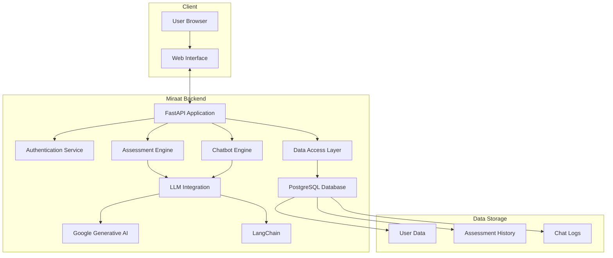

# Miraat: Mental Health Assessment and Improvement Platform

## Overview

Miraat is a comprehensive platform designed to assess and improve mental health through AI-powered tools. The platform offers personalized assessments, intelligent chatbot support, and progress tracking to help users understand and enhance their mental wellbeing.

## Key Features

- **Mental Health Assessments**: Customized evaluations to gauge mental wellbeing
- **AI-Powered Chatbot**: Provides support and resources for mental health concerns
- **Secure User Authentication**: JWT-based system for data privacy and security
- **Progress Tracking**: Monitor improvements over time through test history
- **LLM Integration**: Leverages advanced language models for assessment and support

## Architecture Diagram



## Technology Stack

### Backend
- **Framework**: FastAPI
- **Database**: PostgreSQL with SQLAlchemy ORM
- **Authentication**: JWT (JSON Web Tokens)
- **AI/ML**: Google Generative AI, LangChain, Transformers, Sentence Transformers
- **Containerization**: Docker & Docker Compose

### Frontend
- Node.js-based build system (integrated with backend)

## Project Structure

```
Miraat/
├── backend/
│   ├── core_logic/
│   │   ├── Accessories/        # Utilities, logging, exception handling
│   │   ├── Assessment/         # Mental health assessment logic
│   │   ├── ChatBot/            # AI chatbot implementation
│   │   ├── Data/               # Database models, schemas
│   │   └── LLM/                # Language model integration
│   ├── templates/              # Jinja2 templates
│   ├── static/                 # Static assets
│   ├── main.py                 # Main FastAPI application
│   ├── Dockerfile              # Backend container definition
│   └── pyproject.toml          # Python dependencies
├── frontend/                   # Frontend code
├── docker-compose.yml          # Multi-container setup
└── .env                        # Environment variables (not tracked in git)
```

## Getting Started

### Prerequisites

- Docker and Docker Compose
- Python 3.10 or higher (for local development)
- PostgreSQL (automatically set up via Docker)

### Environment Setup

Create a .env file in the root directory with the following variables:

```
# Database
DB_USER=your_db_user
DB_PASSWORD=your_db_password
DB_NAME=miraat_db

# Application
SECRET_KEY=your_secret_key_for_jwt
BASE_URL=http://localhost:8000

# AI Integration
GOOGLE_API_KEY=your_google_api_key
```

### Running with Docker

```bash
# Build and start all services
docker-compose up --build

# Access the application at http://localhost:8000
```

### Running Locally (Development)

```bash
# Navigate to backend directory
cd backend

# Install dependencies
pip install -e .

# Run the application
uvicorn main:app --reload
```

## API Endpoints

The platform provides several API endpoints:

- **Web Pages**
  - `/` - Home page
  - `/assessment` - Assessment interface
  - `/chatbot` - Chatbot interface
  - `/helplines` - Mental health helpline information
  - `/login` - User login page
  - `/dashboard` - User dashboard
  - `/history` - View history page

- **Authentication**
  - `/register` - Create new user account
  - `/token` - Obtain JWT token

- **Assessments**
  - `/assess_text` - Process text for mental health analysis
  - `/get_test_questions` - Generate mental health assessment questions
  - `/get_inference_from_test` - Process and evaluate test responses
  - `/get_solution_text` - Get solutions based on assessment

- **Chatbot**
  - `/start_chatbot_session` - Initialize chatbot conversation
  - `/chatbot_response` - Get response from mental health chatbot

- **User Data**
  - `/test-history` - View detailed assessment history

## Contributing

1. Fork the repository
2. Create a feature branch (`git checkout -b feature/amazing-feature`)
3. Commit your changes (`git commit -m 'Add some amazing feature'`)
4. Push to the branch (`git push origin feature/amazing-feature`)
5. Open a Pull Request

## License

This project is licensed under the MIT License - see the LICENSE file for details.

## Acknowledgments

- Mental health assessment methodologies
- Open-source AI and machine learning libraries
- FastAPI framework and community
