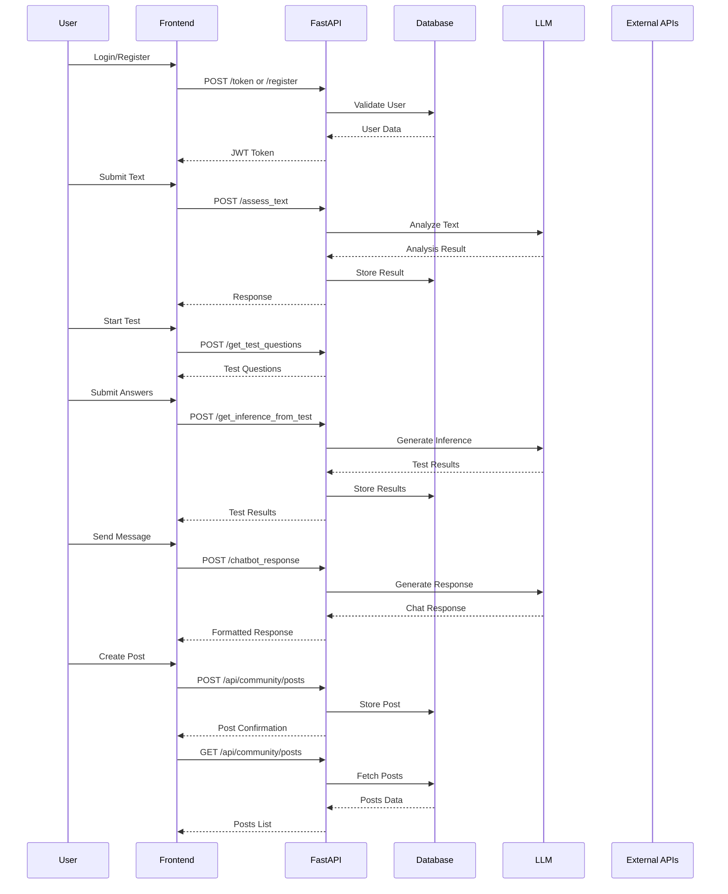
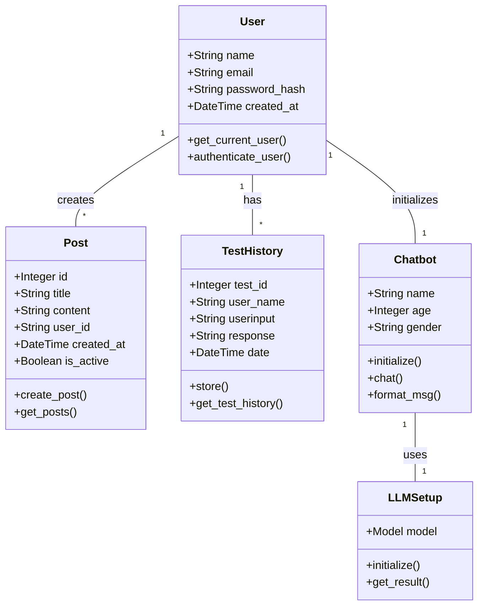
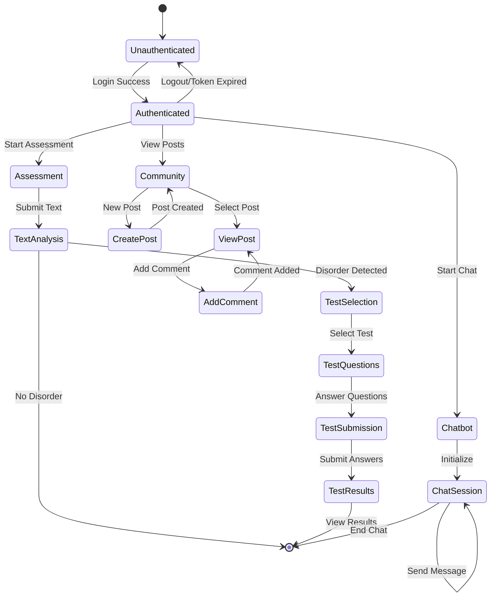

```mermaid
graph TD
    A[FastAPI Application] --> B[Authentication]
    A --> C[Assessment Module]
    A --> D[Chatbot Module]
    A --> E[Community Module]
    A --> F[Database]
    A --> G[LLM Setup]

    %% Authentication Module
    B --> B1[Login]
    B --> B2[Register]
    B --> B3[JWT Token]
    B --> B4[User Management]

    %% Assessment Module
    C --> C1[Text Analysis]
    C --> C2[Test Questions]
    C --> C3[Test Inference]
    C --> C4[Test History]

    %% Chatbot Module
    D --> D1[Chat Session]
    D --> D2[Message Formatting]
    D --> D3[Response Generation]

    %% Community Module
    E --> E1[Posts]
    E --> E2[Comments]
    E --> E3[User Profiles]
    E --> E4[Diagnostics]

    %% Database
    F --> F1[User Table]
    F --> F2[Test History Table]
    F --> F3[Posts Table]
    F --> F4[Comments Table]

    %% LLM Setup
    G --> G1[Gemini API]
    G --> G2[Model Configuration]

    %% Routes and Endpoints
    A --> H[Routes]
    H --> H1[HTML Routes]
    H --> H2[API Routes]
    H --> H3[Auth Routes]

    %% Static Files
    A --> I[Static Files]
    I --> I1[JavaScript]
    I --> I2[CSS]
    I --> I3[Images]

    %% Templates
    A --> J[Templates]
    J --> J1[HTML Templates]
    J --> J2[Error Pages]

    %% Configuration
    A --> K[Configuration]
    K --> K1[Environment Variables]
    K --> K2[Database Config]
    K --> K3[API Keys]

    %% Dependencies
    A --> L[Dependencies]
    L --> L1[FastAPI]
    L --> L2[SQLAlchemy]
    L --> L3[JWT]
    L --> L4[Pydantic]
    L --> L5[Google API]

    %% Data Flow
    C1 --> F2
    C2 --> C3
    C3 --> F2
    D1 --> D3
    D3 --> G1
    E1 --> F3
    E2 --> F4
    B1 --> B3
    B2 --> F1
```

```mermaid
sequenceDiagram
    participant User
    participant Frontend
    participant FastAPI
    participant Database
    participant LLM
    participant External APIs

    %% Authentication Flow
    User->>Frontend: Login/Register
    Frontend->>FastAPI: POST /token or /register
    FastAPI->>Database: Validate User
    Database-->>FastAPI: User Data
    FastAPI-->>Frontend: JWT Token

    %% Assessment Flow
    User->>Frontend: Submit Text
    Frontend->>FastAPI: POST /assess_text
    FastAPI->>LLM: Analyze Text
    LLM-->>FastAPI: Analysis Result
    FastAPI->>Database: Store Result
    FastAPI-->>Frontend: Response

    %% Test Flow
    User->>Frontend: Start Test
    Frontend->>FastAPI: POST /get_test_questions
    FastAPI-->>Frontend: Test Questions
    User->>Frontend: Submit Answers
    Frontend->>FastAPI: POST /get_inference_from_test
    FastAPI->>LLM: Generate Inference
    LLM-->>FastAPI: Test Results
    FastAPI->>Database: Store Results
    FastAPI-->>Frontend: Test Results

    %% Chatbot Flow
    User->>Frontend: Send Message
    Frontend->>FastAPI: POST /chatbot_response
    FastAPI->>LLM: Generate Response
    LLM-->>FastAPI: Chat Response
    FastAPI-->>Frontend: Formatted Response

    %% Community Flow
    User->>Frontend: Create Post
    Frontend->>FastAPI: POST /api/community/posts
    FastAPI->>Database: Store Post
    FastAPI-->>Frontend: Post Confirmation
    Frontend->>FastAPI: GET /api/community/posts
    FastAPI->>Database: Fetch Posts
    Database-->>FastAPI: Posts Data
    FastAPI-->>Frontend: Posts List
```

```mermaid
classDiagram
    class User {
        +String name
        +String email
        +String password_hash
        +DateTime created_at
        +get_current_user()
        +authenticate_user()
    }

    class Post {
        +Integer id
        +String title
        +String content
        +String user_id
        +DateTime created_at
        +Boolean is_active
        +create_post()
        +get_posts()
    }

    class TestHistory {
        +Integer test_id
        +String user_name
        +String userinput
        +String response
        +DateTime date
        +store()
        +get_test_history()
    }

    class Chatbot {
        +String name
        +Integer age
        +String gender
        +initialize()
        +chat()
        +format_msg()
    }

    class LLMSetup {
        +Model model
        +initialize()
        +get_result()
    }

    User "1" -- "*" Post : creates
    User "1" -- "*" TestHistory : has
    Chatbot "1" -- "1" LLMSetup : uses
    User "1" -- "1" Chatbot : initializes
```

```mermaid
stateDiagram-v2
    [*] --> Unauthenticated
    Unauthenticated --> Authenticated: Login Success
    Authenticated --> Unauthenticated: Logout/Token Expired

    Authenticated --> Assessment: Start Assessment
    Assessment --> TextAnalysis: Submit Text
    TextAnalysis --> TestSelection: Disorder Detected
    TextAnalysis --> [*]: No Disorder

    TestSelection --> TestQuestions: Select Test
    TestQuestions --> TestSubmission: Answer Questions
    TestSubmission --> TestResults: Submit Answers
    TestResults --> [*]: View Results

    Authenticated --> Chatbot: Start Chat
    Chatbot --> ChatSession: Initialize
    ChatSession --> ChatSession: Send Message
    ChatSession --> [*]: End Chat

    Authenticated --> Community: View Posts
    Community --> CreatePost: New Post
    CreatePost --> Community: Post Created
    Community --> ViewPost: Select Post
    ViewPost --> AddComment: Add Comment
    AddComment --> ViewPost: Comment Added
``` 